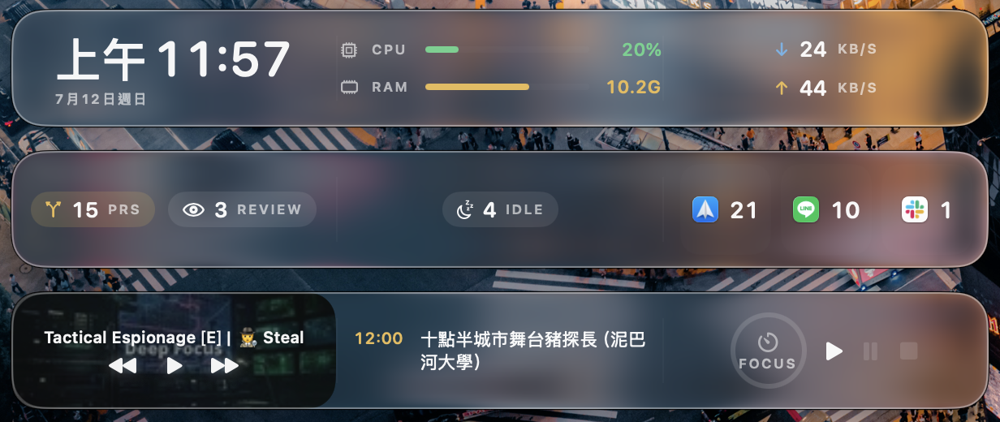

# Spacer

桌面上的浮動玻璃面板，放你想看的小工具（widget），想擺哪就擺哪。

可以開很多塊、各自放不同 widget；拖到 dock 兩側死角再釘住，就變回「dock 旁的資訊條」。



macOS 14+（玻璃背景在 macOS 26 是 Liquid Glass，較舊版本退回毛玻璃）。純 SwiftUI/AppKit，
單一檔案 `Sources/Spacer/main.swift`。

## 安裝

```sh
swift run          # 直接跑，不需要任何憑證
./make-app.sh      # 打包成 /Applications/Spacer.app
```

`swift run` clone 下來就能測，不用開發者憑證。`make-app.sh` 有 Developer ID 憑證就用它簽
（TCC 授權重 build 不會失效），沒有就自動 ad-hoc 簽（`-s -`）——一樣能本機跑，只是 TCC 每次重 build 要重按。

以 menu bar accessory 常駐（沒有 dock 圖示），選單列的格子圖示管理所有面板，
並可開關 Launch at Login。

## 面板

- **Add Panel** — 選單列新增一塊；每塊有自己的 widget 清單、位置、釘住狀態，存 UserDefaults。
- **拖曳** — 拖面板背景即可移動。
- **Pin** — 釘住後鎖定位置、不能再拖；再點一次解除。
- 面板寬度 = widget 數 × 200 + 分隔線；加／移 widget 會立刻變寬變窄。
- 在面板的 widget 上**右鍵**：左右移、放大／縮小字級、Add Widget、Remove。

## Widget

| Widget | 顯示 | 點擊 | 相依 |
|--------|------|------|------|
| Clock | 時間（圓體等寬）＋日期 | Clock.app | — |
| CPU / RAM | 負載膠囊儀表（綠→琥珀→紅） | Activity Monitor | — |
| Network | ↓／↑ 即時流量 | Activity Monitor | — |
| GitHub | 我的開啟 PR 數・待我 review 數 | github.com | `gh`（已登入） |
| Now Playing | 封面滿版當背景＋跑馬燈標題＋播放控制 | 沒播放時開 YouTube | `media-control`（brew） |
| Calendar | 今天接下來幾個行程 | Calendar.app | 行事曆授權 |
| Pomodoro | 倒數進度環 | 點一下開始／停止 25 分鐘 | — |
| herdr Agents | 遠端 agent 狀態（working／blocked／idle） | 跳到既有 Ghostty 分頁或新開一個 | `ssh` + 遠端 herdr；需設 `herdrHost` |
| Unread | Spark／LINE／Slack 的 dock 紅點徽章 | 開對應 app | 輔助使用權限 |

所有 widget 共用一組「儀表」視覺語彙：圓體等寬數字 + 微型大寫標籤 + 琥珀 HUD 色。

## 選單

Start / Stop Pomodoro ・ 每塊面板（Pin、widget 管理、Remove Panel）・ Add Panel ・
Glass Background ・ Panel Border ・ Launch at Login ・ Quit。

## 權限與相依

- **Calendar**：EventKit，第一次點 Calendar widget 會要授權。
- **Apple Events**：herdr widget 用 AppleScript 操作 Ghostty 開分頁，第一次會要授權。
- **輔助使用（Accessibility）**：Unread widget 讀 dock 徽章要用；沒授權會顯示 `grant access`，
  點一下會跳系統提示，或到 System Settings → Privacy & Security → Accessibility 開 Spacer。
- 選用 CLI：`gh`（GitHub）、`media-control`（Now Playing）、`ssh`＋遠端 `herdr`（herdr widget）。
  沒裝的 widget 會顯示 `—`，不影響其他 widget。
- **herdr 主機**：herdr widget 要連的 ssh host 沒寫死，用
  `defaults write com.unayung.Spacer herdrHost <你的-ssh-host>` 設定後重開即可（沒設會顯示 `set herdrHost`）。

## 取捨（要升級再說）

- widget 內容與點擊動作寫死在 `main.swift`（herdr 主機除外）。
- 面板是純浮動：不會自動閃避 dock 放大，也不會在 fullscreen 時自動隱藏。
